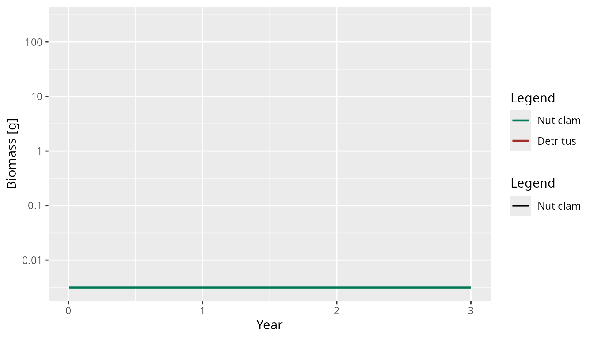
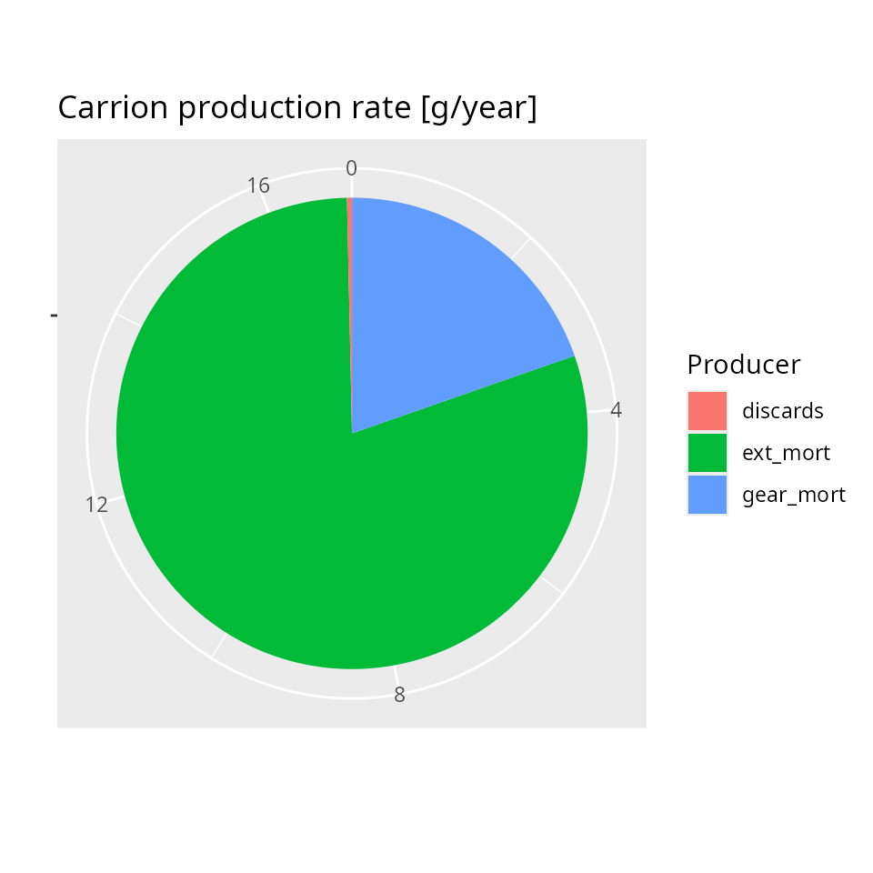
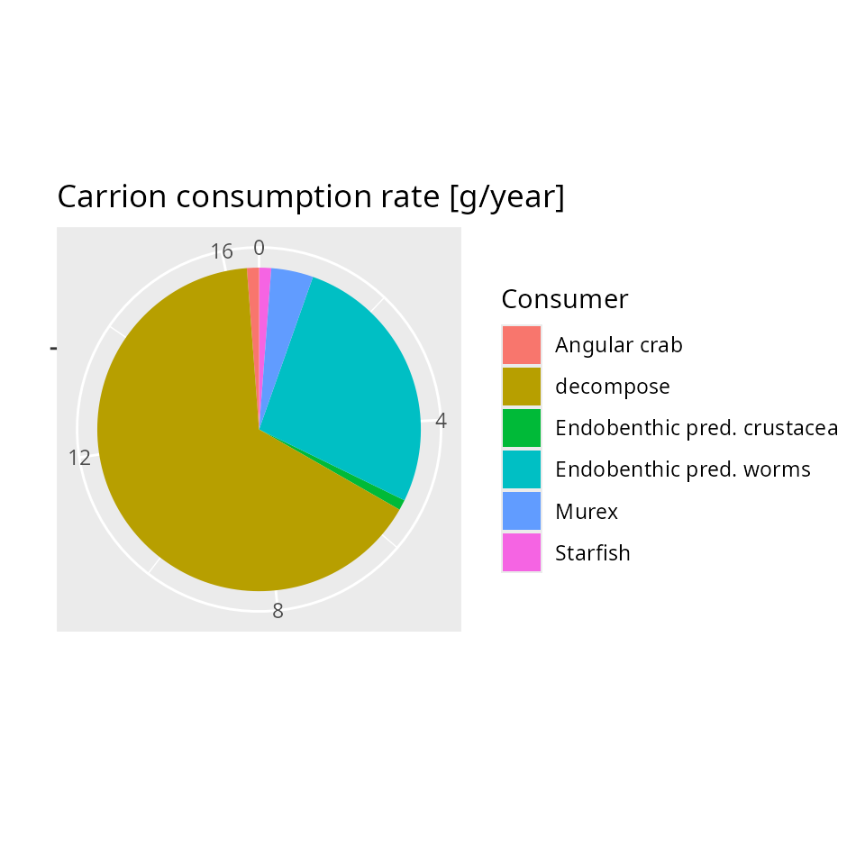

# How mizerShelf extends mizer

## Overview

mizerShelf is an extension package for mizer that adds two extra
ecosystem components to a standard multispecies size-spectrum model:

- **detritus** — particulate organic matter that settles to the seafloor
  and provides food for small benthic organisms and juvenile fish,
- **carrion** — fresh animal tissue from natural deaths, fishing gear
  mortality, and discards that is consumed by scavengers before
  decomposing into detritus.

Both components are dynamical: their biomasses change over time in
response to species abundances and fishing effort. The package uses four
of the five extension mechanisms described in
`vignette("extensions", package = "mizer")`:

| Extension mechanism | Used for |
|----|----|
| [`setRateFunction()`](https://sizespectrum.org/mizer/reference/setRateFunction.html) | Replace standard mortality with shelf mortality that includes excess gear mortality |
| Resource dynamics override | Implement detritus dynamics in place of the default semi-chemostat resource |
| [`setComponent()`](https://sizespectrum.org/mizer/reference/setComponent.html) | Add carrion as a scalar dynamical component that contributes to the encounter rate |
| S4 subclassing + S3 dispatch | Define `mizerShelf`/`mizerShelfSim` marker classes for shelf-specific plotting, scaling, and species manipulation |

All four mechanisms are wired together inside
[`newDetritusCarrionParams()`](https://sizespectrum.org/mizerShelf/reference/newDetritusCarrionParams.md),
which is the single entry point for building a shelf model.

## The `mizerShelf` marker class

mizerShelf defines two S4 marker subclasses:

``` r
setClass("mizerShelf",    contains = "MizerParams")
setClass("mizerShelfSim", contains = "MizerSim")
```

These classes carry no extra slots. Their purpose is to trigger S3
dispatch so that shelf-specific behaviour is used automatically whenever
a user calls a mizer generic on a `mizerShelf` object. The classes are
marker classes in the sense described in
`vignette("extensions", package = "mizer")`.

[`newDetritusCarrionParams()`](https://sizespectrum.org/mizerShelf/reference/newDetritusCarrionParams.md)
records the extension in `params@extensions` and coerces the result to
the `mizerShelf` marker class:

``` r
params@extensions <- c(mizerShelf = as.character(packageVersion("mizerShelf")))
new("mizerShelf", params)
```

Recording the extension in `params@extensions` is what allows mizer to
automatically produce a `mizerShelfSim` whenever
[`project()`](https://sizespectrum.org/mizer/reference/project.html) is
called: mizer’s own
[`MizerSim()`](https://sizespectrum.org/mizer/reference/MizerSim.html)
constructor calls
[`coerceToExtensionClass()`](https://sizespectrum.org/mizer/reference/coerceToExtensionClass.html),
which reads `params@extensions`, sees `mizerShelf`, and coerces the new
sim object to `mizerShelfSim`.

### Methods dispatched on `mizerShelf`

The following S3 methods are dispatched on `mizerShelf` or
`mizerShelfSim`:

| Method | What it adds |
|----|----|
| [`getBiomass.mizerShelf()`](https://sizespectrum.org/mizerShelf/reference/getBiomass.md) | Adds detritus and carrion biomasses to the species biomasses |
| `getBiomass.mizerShelfSim()` | Same, as a time series |
| [`steady.mizerShelf()`](https://sizespectrum.org/mizerShelf/reference/steady.md) | Calls [`tune_carrion_detritus()`](https://sizespectrum.org/mizerShelf/reference/tune_carrion_detritus.md) after convergence |
| [`scaleModel.mizerShelf()`](https://sizespectrum.org/mizerShelf/reference/scaleModel.md) | Adjusts carrion encounter rates and external detritus input when rescaling abundances |
| [`removeSpecies.mizerShelf()`](https://sizespectrum.org/mizerShelf/reference/removeSpecies.md) | Updates the carrion encounter-rate matrix `rho` |
| [`addSpecies.mizerShelf()`](https://sizespectrum.org/mizerShelf/reference/addSpecies.md) | Computes the initial `rho_carrion` for new species |

Each of these methods calls
[`NextMethod()`](https://rdrr.io/r/base/UseMethod.html) so that it first
runs the standard mizer behaviour and then makes only the shelf-specific
adjustments.

#### Example: `getBiomass`

The standard
[`getBiomass()`](https://sizespectrum.org/mizerShelf/reference/getBiomass.md)
returns only species biomasses. The shelf version appends the detritus
and carrion biomasses:

``` r
getBiomass.mizerShelf <- function(object, ...) {
    params <- object
    b <- NextMethod()                               # standard species biomasses
    d_biomass <- sum(params@initial_n_pp *
                     params@dw_full * params@w_full) # integrate resource spectrum
    b <- c(b, Detritus = d_biomass)
    scalar_other <- Filter(
        function(x) is.numeric(x) && length(x) == 1,
        params@initial_n_other)
    if (length(scalar_other) > 0) b <- c(b, unlist(scalar_other))
    b
}
```

Because
[`plotBiomass()`](https://sizespectrum.org/mizer/reference/plotBiomass.html)
calls
[`getBiomass()`](https://sizespectrum.org/mizerShelf/reference/getBiomass.md)
internally, this single override makes biomass plots show detritus and
carrion alongside fish species without any further changes.

``` r
getBiomass(NWMed_params)[1:3]
#>     Small DF worms Small DF crustacea           DF worms 
#>          0.6514945          0.1603410          0.7829609
```

``` r
sim <- project(NWMed_params, t_max = 3, t_save = 0.5, progress_bar = FALSE)
plotBiomass(sim, species = c("Nut clam", "Detritus"))
#> Warning: Removed 7 rows containing missing values or values outside the scale range
#> (`geom_line()`).
```



## Detritus: overriding the resource dynamics

Mizer’s standard resource spectrum follows a semi-chemostat towards a
carrying capacity. mizerShelf replaces this with
[`detritus_dynamics()`](https://sizespectrum.org/mizerShelf/reference/detritus_dynamics.md),
which is registered via the `resource_dynamics` argument to
[`newMultispeciesParams()`](https://sizespectrum.org/mizer/reference/newMultispeciesParams.html):

``` r
params <- newMultispeciesParams(
    species_params = species_params,
    resource_dynamics = "detritus_dynamics",
    ...
)
```

This is the lightest-weight way to change the resource because it reuses
all of mizer’s resource infrastructure — the size grid, the resource
abundance array `n_pp`, the `resource_mort` rate, and so on — while
replacing only the update step.

### The detritus ODE

The detritus spectrum is always held at a fixed power-law shape; only
its overall biomass $`B`$ is dynamical. The biomass satisfies

``` math
\frac{dB}{dt} = \text{production} - \text{consumption} \cdot B + \text{external}
```

where:

- **production** comes from unassimilated food (faeces), decomposing
  carrion, and an external input from the pelagic zone
  ([`getDetritusProduction()`](https://sizespectrum.org/mizerShelf/reference/getDetritusProduction.md)),
- **consumption** is the total rate at which species feed on detritus
  ([`detritus_consumption()`](https://sizespectrum.org/mizerShelf/reference/detritus_consumption.md)),
  proportional to the current biomass,
- **external** is a tunable constant that represents sedimentation from
  pelagic waters, stored in `other_params(params)$detritus$external`.

[`detritus_dynamics()`](https://sizespectrum.org/mizerShelf/reference/detritus_dynamics.md)
solves this ODE analytically within each time step to avoid the
instabilities of a simple Euler step:

``` math
B(t + \Delta t) = B(t)\,e^{-c\,\Delta t} + \frac{p}{c}\left(1 - e^{-c\,\Delta t}\right)
```

where $`c`$ is the mass-specific consumption rate and $`p`$ is the
production rate. The shape of the spectrum is then scaled to the new
biomass:

``` r
detritus_dynamics <- function(params, n, n_pp, n_other, rates, dt, ...) {
    current_biomass <- detritus_biomass(params, n_pp = n_pp)
    consumption     <- detritus_consumption(params, n_pp, rates) / current_biomass
    production      <- sum(getDetritusProduction(params, n, n_other, rates))
    if (consumption) {
        et           <- exp(-consumption * dt)
        next_biomass <- current_biomass * et + production / consumption * (1 - et)
    } else {
        next_biomass <- current_biomass + production * dt
    }
    n_pp * next_biomass / current_biomass
}
```

The function receives `n_pp` (the current resource spectrum), not the
initial spectrum, so the update is applied to whatever state the
simulation is currently in.

### Steady-state tuning

[`tune_carrion_detritus()`](https://sizespectrum.org/mizerShelf/reference/tune_carrion_detritus.md)
adjusts the external detritus input so that at the current abundances
the detritus is at steady state (`dB/dt = 0`):

``` r
params@other_params$detritus$external <- outflow - production
```

This function is called automatically by
[`steady.mizerShelf()`](https://sizespectrum.org/mizerShelf/reference/steady.md)
after mizer’s own steady-state iteration converges.

### User-facing controls

Two getter/setter pairs make it easy to calibrate the detritus:

- `detritus_biomass(params)` — total detritus biomass in grams.
- `detritus_lifetime(params)` — the expected time a unit of detritus
  survives before being consumed, equal to
  $`B / (\text{consumption rate})`$.
- `detritus_lifetime(params) <- value` — rescales detritus abundance
  while keeping total consumption unchanged (by adjusting
  `interaction_resource`).

``` r
detritus_lifetime(params)
#> [1] 1
```

## Carrion: adding a new dynamical component

Carrion is not naturally represented by any existing mizer structure: it
is a scalar total biomass (not size-structured), produced by mortality
and consumed by scavengers with a species- and size-dependent encounter
rate. It is registered as an *other* component via
[`setComponent()`](https://sizespectrum.org/mizer/reference/setComponent.html):

``` r
params <- setComponent(
    params, "carrion",
    initial_value  = 1,
    dynamics_fun   = "carrion_dynamics",
    encounter_fun  = "encounter_contribution",
    component_params = list(rho = rho))
```

The three arguments name the functions that mizer will call at each time
step:

- `dynamics_fun = "carrion_dynamics"` — updates the carrion biomass.
- `encounter_fun = "encounter_contribution"` — adds the carrion’s
  contribution to each species’ encounter rate.
- `component_params` stores the `rho` matrix (species × size) and a
  decomposition rate in `other_params(params)$carrion`.

### Encounter contribution

The contribution of carrion to the encounter rate of species $`i`$ at
body size $`w`$ is

``` math
E_i^{\text{carrion}}(w) = \rho_i(w)\,B_{\text{carrion}}
```

where $`\rho_i(w)`$ is a species- and size-dependent encounter rate
coefficient stored in the component parameters. The function
[`encounter_contribution()`](https://sizespectrum.org/mizerShelf/reference/encounter_contribution.md)
is a generic helper that works for any scalar other-component:

``` r
encounter_contribution <- function(params, n_other, component, ...) {
    params@other_params[[component]]$rho * n_other[[component]]
}
```

The `rho` matrix is initialised in
[`newDetritusCarrionParams()`](https://sizespectrum.org/mizerShelf/reference/newDetritusCarrionParams.md)
so that each species has enough food from all sources (fish prey,
detritus, and carrion) to reach a feeding level of `f0` at maximum body
size.

### Carrion dynamics

The carrion biomass $`B`$ satisfies the same ODE structure as the
detritus:

``` math
\frac{dB}{dt} = \text{production} - \text{consumption} \cdot B
```

- **production**
  ([`getCarrionProduction()`](https://sizespectrum.org/mizerShelf/reference/getCarrionProduction.md))
  comes from three sources:
  - a fraction `ext_prop` of natural (non-predation) mortality,
  - excess gear mortality
    ([`gearMort()`](https://sizespectrum.org/mizerShelf/reference/gearMort.md)),
    i.e. animals killed by the gear but not landed,
  - discards — landed animals that are thrown back.
- **consumption**
  ([`carrion_consumption_ms()`](https://sizespectrum.org/mizerShelf/reference/carrion_consumption_ms.md))
  includes active consumption by fish scavenging carrion plus bacterial
  decomposition.

As with detritus, the ODE is solved analytically within each time step:

``` r
carrion_dynamics <- function(params, n, n_other, rates, dt, ...) {
    consumption <- carrion_consumption_ms(params, n, rates)
    production  <- sum(getCarrionProduction(params, n, rates))
    if (consumption) {
        et <- exp(-consumption * dt)
        return(n_other$carrion * et + production / consumption * (1 - et))
    }
    return(n_other$carrion + production * dt)
}
```

### Production and consumption breakdown

The package provides functions to inspect where carrion comes from and
where it goes:

``` r
plotCarrionProduction(params)
```



``` r
plotCarrionConsumption(params)
```



### User-facing controls

- `carrion_lifetime(params)` — expected lifespan of carrion in years.
- `carrion_lifetime(params) <- value` — rescales the carrion biomass and
  its encounter-rate coefficients while keeping total consumption
  unchanged.
- `carrion_human_origin(params)` — fraction of carrion production that
  comes from fishing (gear mortality + discards).
- `carrion_human_origin(params) <- value` — adjusts `ext_prop` (the
  fraction of natural mortality that produces carrion) to hit the
  target.

``` r
carrion_lifetime(params)
#> [1] 0.002739726
carrion_human_origin(params)
#> [1] 0.2
```

## The custom mortality rate

Standard mizer fishing mortality accounts only for fish that are
extracted from the water. Continental shelf fisheries also kill animals
that remain on the seabed after contact with bottom-trawl gear.
mizerShelf captures this distinction with a custom mortality function
registered via
[`setRateFunction()`](https://sizespectrum.org/mizer/reference/setRateFunction.html):

``` r
params <- setRateFunction(params, "Mort", "seMort")
```

[`seMort()`](https://sizespectrum.org/mizerShelf/reference/seMort.md)
calls the standard
[`mizerMort()`](https://sizespectrum.org/mizer/reference/mizerMort.html)
and adds the excess gear mortality on top:

``` r
seMort <- function(params, n, n_pp, n_other, t, f_mort, pred_mort, ...) {
    mizerMort(params, n, n_pp, n_other, t, f_mort, pred_mort, ...) +
        gearMort(params, f_mort = f_mort)
}
```

[`gearMort()`](https://sizespectrum.org/mizerShelf/reference/gearMort.md)
returns `max(gear_mort - f_mort, 0)`, where `gear_mort` is a species
parameter giving the total rate at which animals die due to gear
contact. When fishing mortality is below this cap, the remainder enters
total mortality and also enters the carrion production (via
[`getCarrionProduction()`](https://sizespectrum.org/mizerShelf/reference/getCarrionProduction.md)).
When fishing mortality exceeds `gear_mort`, excess gear mortality is
zero.

The custom rate function receives and returns exactly the same array
shape as
[`mizerMort()`](https://sizespectrum.org/mizer/reference/mizerMort.html)
(species × size), so it is a drop-in replacement that adds one
ecological process without changing anything else.

## How the pieces fit together in `newDetritusCarrionParams()`

All four extension mechanisms are wired up inside a single constructor:

``` r
newDetritusCarrionParams <- function(species_params,
                                     w_min_detritus = NA,
                                     w_max_detritus = 1,
                                     n = 0.7, ...) {
    # 1. Detritus: override resource dynamics
    params <- newMultispeciesParams(
        species_params   = species_params,
        min_w_pp         = w_min_detritus,
        w_pp_cutoff      = w_max_detritus,
        n = n, p = n,
        resource_dynamics = "detritus_dynamics",
        ...)

    # Initialise rho so each species can reach feeding level f0 at max size
    f0  <- set_species_param_default(params@species_params, "f0", 0.6)$f0
    ic  <- set_species_param_default(
               params@species_params, "interaction_carrion", 1)$interaction_carrion
    E   <- getEncounter(params)[, length(params@w)] /
               (params@w[length(params@w)] ^ n)
    rho <- pmax(0, f0 * params@species_params$h / (1 - f0) - E) * ic
    params@species_params$rho_carrion <- rho
    rho <- outer(params@species_params$rho_carrion, params@w ^ n)

    # 2. Mortality: custom rate function adds excess gear mortality
    params <- setRateFunction(params, "Mort", "seMort")

    # 3. Carrion: scalar dynamical component
    params <- setComponent(
        params, "carrion", initial_value = 1,
        dynamics_fun     = "carrion_dynamics",
        encounter_fun    = "encounter_contribution",
        component_params = list(rho = rho))

    # 4. Marker class: enables S3 dispatch for shelf-specific methods
    params <- setColours(params,
                         c(Detritus = "forestgreen", carrion = "peru"))
    new("mizerShelf", params)
}
```

The order matters. The resource dynamics are set inside
[`newMultispeciesParams()`](https://sizespectrum.org/mizer/reference/newMultispeciesParams.html)
before mizer computes initial rates, so the detritus shape is consistent
from the start. The carrion component is registered after the species
parameters are set, so that `rho` can be computed from the initial
encounter rates. The marker class is applied last, after all the
standard mizer slots have been populated.

## Summary

mizerShelf illustrates all four of the core mizer extension mechanisms
working together:

1.  **Resource dynamics override** — detritus reuses mizer’s resource
    spectrum infrastructure with a custom ODE that tracks total biomass
    and rescales the spectrum shape.

2.  **[`setRateFunction()`](https://sizespectrum.org/mizer/reference/setRateFunction.html)**
    — the custom
    [`seMort()`](https://sizespectrum.org/mizerShelf/reference/seMort.md)
    adds excess gear mortality to the standard mortality calculation
    with a single-line wrapper around
    [`mizerMort()`](https://sizespectrum.org/mizer/reference/mizerMort.html).

3.  **[`setComponent()`](https://sizespectrum.org/mizer/reference/setComponent.html)**
    — carrion is a scalar dynamical variable whose biomass evolves each
    time step and whose encounter-rate contribution is automatically
    included in
    [`getEncounter()`](https://sizespectrum.org/mizer/reference/getEncounter.html)
    and
    [`getDiet()`](https://sizespectrum.org/mizer/reference/getDiet.html).

4.  **S4 marker classes + S3 dispatch** — `mizerShelf` and
    `mizerShelfSim` ensure that shelf-specific methods (`getBiomass`,
    `steady`, `scaleModel`, `addSpecies`, `removeSpecies`) are
    dispatched automatically, while every override delegates to
    [`NextMethod()`](https://rdrr.io/r/base/UseMethod.html) so that the
    full mizer pipeline remains intact.

Together, these mechanisms allow mizerShelf to add two ecologically
important processes — benthic detritus and carrion scavenging — to any
mizer model without modifying the mizer source code.
