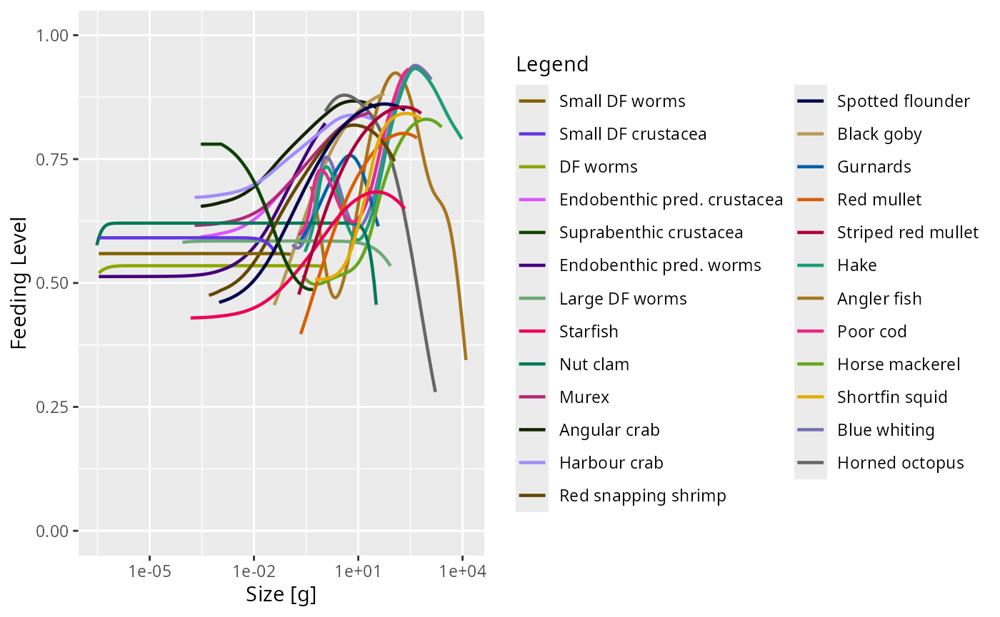

# Model description

In this document we present the details of the model. The model consists
of three components:

1.  a collection of [species](#species),
2.  [carrion](#carrion) and
3.  [detritus](#detritus).

We discuss each of these in turn below. In addition to the description
of the general model, the sections of this document also include
“Parameter values” subsections that give numerical values for the model
parameters introduced in that section. These are the parameter values we
chose for describing the shelf ecosystem off the coast of Blanes in the
Northwestern Mediterranean.

These parameter value sections start with a “Skip” link that allows you
to jump over them to the next section of model description.

If you prefer, you can [view and download a pdf version of this
document](https://github.com/sizespectrum/mizerShelf/blob/master/inst/model_description.pdf).

## Species

##### Parameter values

Skip to [Size-spectrum dynamics](#size-spectrum-dynamics)

We model 25 species, in addition to carrion and detritus. For each of
these species we have some estimates of their observed abundances. While
the observed abundances of the species are not directly model
parameters, we have used them to choose the reproduction parameters
(discussed later) so that the steady state abundances in the model agree
with these observations.

For some species the total biomass above a certain cutoff size has been
observed. The following table gives the observed biomass per square
meter in grams and the cutoff size in grams. Individuals smaller than
the cutoff size were not observable by the method used.

|                        | Biomass \[g/m^2\] | cutoff size \[g\] |
|:-----------------------|------------------:|------------------:|
| Suprabenthic crustacea |          0.029920 |         0.0000002 |
| Red mullet             |          0.007353 |         0.2477958 |
| Striped red mullet     |          0.004605 |         0.1985973 |
| Hake                   |          0.023309 |         0.2988306 |
| Angler fish            |          0.007062 |         0.4560274 |
| Poor cod               |          0.004895 |         0.2816911 |
| Horse mackerel         |          0.014135 |         0.2816911 |
| Shortfin squid         |          0.012708 |         0.1727642 |
| Blue whiting           |          0.010577 |         0.1279088 |
| Horned octopus         |          0.008658 |         1.2053885 |

For the other species the total number above a certain cutoff size has
been observed instead:

|                             |    Numbers | cutoff size \[g\] |
|:----------------------------|-----------:|------------------:|
| Small DF worms              | 279.600000 |         0.0000925 |
| Small DF crustacea          |  79.600000 |         0.0000004 |
| DF worms                    | 257.000000 |         0.0000925 |
| Endobenthic pred. crustacea |   4.950000 |         0.0000002 |
| Endobenthic pred. worms     | 199.000000 |         0.0000925 |
| Large DF worms              |  95.000000 |         0.0000925 |
| Starfish                    |   0.118140 |         0.0141759 |
| Nut clam                    |   0.013090 |         0.0370770 |
| Murex                       |   0.063220 |         0.0190637 |
| Angular crab                |   0.033650 |         0.0736550 |
| Harbour crab                |   0.027150 |         0.0338993 |
| Red snapping shrimp         |   0.025960 |         0.0690487 |
| Spotted flounder            |   0.061470 |         0.0428709 |
| Black goby                  |   0.012653 |         0.0972259 |
| Gurnards                    |   0.023970 |         0.0843025 |

For the commercial species we also have the yearly fishery yield, given
in the table below in grams per square meter per year. For these species
we calibrated the model abundances so that the estimated fishing
mortalities lead to these yields.

|                    | Yield \[g/m^2/yr\] |
|:-------------------|-------------------:|
| Red mullet         |           0.005909 |
| Striped red mullet |           0.003158 |
| Hake               |           0.019209 |
| Angler fish        |           0.005017 |
| Poor cod           |           0.003687 |
| Horse mackerel     |           0.011020 |
| Shortfin squid     |           0.006702 |
| Blue whiting       |           0.008069 |
| Horned octopus     |           0.005678 |

### Size-spectrum dynamics

The model assumes that, to a first approximation, an individual can be
characterized by its weight $`w`$ and its species number $`i`$ only. The
aim of the model is to calculate the size spectrum $`N_i(w)`$, which is
the *density* of individuals of species $`i`$ and size $`w`$. The number
of individuals in a size range is obtained from the density by
integrating over the size range, such that $`\int_w^{w+dw}N_i(w)dw`$ is
the number of individuals of species $`i`$ in the size interval
$`[w,w+dw]`$. In other words: the number of individuals in a size range
is the area under the number density $`N_i(w)`$.

The time evolution of the number density $`N_i(w)`$ is described by the
McKendrick-von Foerster equation, which is a transport equation
describing the transport of biomass from small to large individuals,
with an additional loss term due to fish mortality:

``` math

  \frac{\partial N_i(w)}{\partial t} + \frac{\partial g_i(w) N_i(w)}{\partial w} 
  = -\mu_i(w) N_i(w).
```

The individual growth rate $`g_i(w)`$ is described below in the
[Growth](#growth) section and the mortality rate $`\mu_i(w)`$ is
described in the [Mortality](#mortality) section. These rates depend on
the density of other fish of other sizes, as well as the carrion and
detritus biomasses, making the size-spectrum dynamics non-linear and
non-local in very interesting ways. The resulting effects are too
complicated to disentangle by pure thought. This is where simulations
with the mizer package come in.

There is no need to understand the mathematical notation used in the
McKendrick-von Foerster equation to understand its origin: it just says
that the rate at which the number of fish in a size bracket increases is
the rate at which fish grow into the size bracket from a smaller size
minus the rate at which fish grow out of it to a larger size minus the
rate at which the fish in the size bracket die.

For the smallest size class, instead of a rate of growth into the size
class there is a rate of reproduction of new individuals into that size
class. This reproduction will be described below in the
[Reproduction](#reproduction) section.

### Growth

Consumers can only grow by consuming prey (including possibly carrion
and detritus), discounting the losses due to metabolic processes.
Predation includes a model for the [predator-prey encounter
rate](#sec:pref) and a model for the rate of
[consumption](#consumption). Taking into account the rate of [metabolic
losses](#metabolic-losses), the resulting energy intake can be
partitioned in the model as energy allocated to
[reproduction](#sec:repro) and energy allocated to [somatic
growth](#somatic-growth).

#### Predator-prey encounter rate

The rate $`E_{i}(w)`$ at which a predator of species $`i`$ and weight
$`w`$ encounters food (mass per time) is obtained by summing over all
prey species and integrating over all prey sizes $`w_p`$, weighted by
the selectivity factors described below and (where relevant) adding the
encounter rates $`E_{C.i}`$ of carrion and $`E_{D.i}`$ of detritus:

``` math

  E_{i}(w) = \gamma_i(w) \int \sum_{j} \theta_{ij} N_j(w_p)
  \phi_i(w,w_p) w_p \, dw_p + E_{C.i}(w) + E_{D.i}(w).
```

The encounter rates for [carrion](#carrion-consumption) and
[detritus](#detritus-consumption) will be described later.

The overall prefactor $`\gamma_i(w)`$ sets the predation power of the
predator. It could be interpreted as a search volume or as an attack
rate. By default it is assumed to scale allometrically as
$`\gamma_i(w) = \gamma_i\, w^{3/4}.`$ In order for $`E_i(w)`$ to have
units of grams per year, the prefactor $`\gamma_i`$ has to have a unit
of $`\text{grams}^{-3/4}`$ per year.

The $`\theta_{ij}`$ matrix sets the interaction strength between
predator species $`i`$ prey species $`j`$.

The size selectivity is encoded in the predation kernel
$`\phi_i(w,w_p)`$. For most predator species we use the lognormal
predation kernel given as

``` math

\phi_i(w, w_p) = 
\exp \left[ \frac{-(\ln(w / w_p / \beta_i))^2}{2\sigma_i^2} \right]
```
if $`w/w_p`$ is larger than 1 and zero otherwise. Here $`\beta_i`$ is
the preferred predator-prey mass ratio and $`\sigma_i`$ determines the
width of the kernel.

For some species we use a power-law kernel with sigmoidal cutoffs given
by

``` math
\phi_i(w, w_p) = 
\frac{(w/w_p)^s}{\left(1+e^{l_l}\frac{w_p}{w}\right)^{u_l}
\left(1+e^{-l_r}\frac{w}{w_p}\right)^{u_r}}.
```
Here the parameters $`l_l`$ and $`u_l`$ determine the sigmoidal cutoff
at low predator/prey mass ratio and $`l_r`$ and $`u_r`$ similarly
determine the cutoff at large predator/prey mass ratio.

##### Parameter values

Skip to [Consumption](#consumption)

The predator/prey interaction matrix has entries equal to either 0 (if
the species can not interact) or 1, see @fig-interaction.


Species interaction matrix

The parameters for the predation kernels were estimated from stomach
data or from the physical characteristics of the species. For the
species that use a lognormal predation kernel, the parameters are given
in the table below. The values for the detritivores were chosen so that
they would have access to detritus throughout their life.

|                             |      beta | sigma |       gamma |
|:----------------------------|----------:|------:|------------:|
| Small DF worms              |   1294.87 |  1.00 |  88.6271911 |
| Small DF crustacea          |    120.00 |  1.00 |  20.0467566 |
| DF worms                    |  12000.00 |  1.00 |  35.0190243 |
| Endobenthic pred. crustacea |     10.90 |  2.00 |   0.9459572 |
| Suprabenthic crustacea      |     10.00 |  2.00 |  41.6477741 |
| Endobenthic pred. worms     |    100.00 |  2.00 |  11.7628322 |
| Large DF worms              | 303667.00 |  1.65 | 107.4676423 |
| Starfish                    |     52.00 |  2.00 |   3.0460681 |
| Nut clam                    |  30887.00 |  0.55 |  84.3311323 |
| Murex                       |     50.25 |  2.00 |  20.0333270 |
| Angular crab                |     10.00 |  2.00 |   9.2501407 |
| Harbour crab                |     10.00 |  2.00 |   5.4169750 |
| Red snapping shrimp         |     10.05 |  2.00 |  13.0726341 |
| Spotted flounder            |     77.00 |  2.00 |   9.5097008 |
| Black goby                  |    200.00 |  2.00 |  15.7167287 |
| Red mullet                  |    283.00 |  1.80 |  11.3438259 |
| Striped red mullet          |    283.00 |  1.80 |  14.8750504 |
| Horse mackerel              |     36.00 |  1.80 | 326.6696815 |
| Shortfin squid              |     10.00 |  2.00 | 452.6942402 |
| Horned octopus              |      2.45 |  1.80 | 169.1917918 |

For the species that use a truncated power law predation kernel. The
parameters are:

|              |          s |      l_l |       u_l |      l_r |       u_r |       gamma |
|:-------------|-----------:|---------:|----------:|---------:|----------:|------------:|
| Gurnards     | -1.0311955 | 1.104517 |  5.759042 | 6.932295 | 14.176132 |    79.17024 |
| Hake         | -0.7999909 | 2.328790 | 29.533925 | 7.625678 | 26.992624 | 10020.12324 |
| Angler fish  | -1.5739389 | 1.283283 |  5.642066 | 6.676509 |  5.054213 | 19031.70090 |
| Poor cod     | -0.6114323 | 1.930589 | 27.643156 | 6.825227 | 32.547350 |  2527.22602 |
| Blue whiting | -0.7999909 | 2.328790 | 29.533925 | 7.625678 | 26.992624 |  8973.69865 |

#### Consumption

The encountered food is consumed subject to a standard Holling
functional response type II to represent satiation. This determines the
*feeding level* $`f_i(w)`$, which is a dimensionless number between 0
(no food) and 1 (fully satiated) so that $`1-f_i(w)`$ is the proportion
of the encountered food that is consumed. The feeding level is given by

``` math

  f_i(w) = \frac{E_i(w)}{E_i(w) + h_i(w)},
```
where $`h_i(w)`$ is the maximum consumption rate of a predator of
species $`i`$ and weight $`w`$. By default we assume an allometric form
$`h_i(w) = h_i\, w^n`$ with $`n=0.7`$. The unit of the coefficients
$`h_i`$ are $`\text{grams}^{1-n}`$ per year.

The rate at which food is consumed by a predator of species $`i`$ and
weight $`w`$ is then
``` math

(1-f_i(w))E_{i}(w)=f_i(w)\, h_i(w).
```
Only a proportion $`\alpha_i`$ of this consumed biomass is retained,
while a proportion $`1-\alpha_i`$ is expelled in the form of feces,
which contribute to the detritus.

##### Parameter values

Skip to [Metabolic losses](#metabolic-losses)

The values for the coefficients $`h_i`$ in the maximum consumption rates
were chosen so that the feeding level that fish experience has a
reasonable value with fish being neither too starved nor totally
satiated.

|                             |      h | alpha |   n |
|:----------------------------|-------:|------:|----:|
| Small DF worms              |  16.00 |   0.6 | 0.7 |
| Small DF crustacea          |   2.82 |   0.6 | 0.7 |
| DF worms                    |   7.80 |   0.6 | 0.7 |
| Endobenthic pred. crustacea |   1.90 |   0.6 | 0.7 |
| Suprabenthic crustacea      |   4.30 |   0.6 | 0.7 |
| Endobenthic pred. worms     |   9.20 |   0.6 | 0.7 |
| Large DF worms              |  38.00 |   0.6 | 0.7 |
| Starfish                    |  14.00 |   0.6 | 0.7 |
| Nut clam                    |   7.60 |   0.6 | 0.7 |
| Murex                       |  34.00 |   0.6 | 0.7 |
| Angular crab                |  11.60 |   0.6 | 0.7 |
| Harbour crab                |  10.00 |   0.6 | 0.7 |
| Red snapping shrimp         |  21.00 |   0.6 | 0.7 |
| Spotted flounder            |  12.00 |   0.6 | 0.7 |
| Black goby                  |  15.10 |   0.6 | 0.7 |
| Gurnards                    |  14.50 |   0.6 | 0.7 |
| Red mullet                  |  20.00 |   0.6 | 0.7 |
| Striped red mullet          |  18.00 |   0.6 | 0.7 |
| Hake                        |  26.00 |   0.6 | 0.7 |
| Angler fish                 |  30.00 |   0.6 | 0.7 |
| Poor cod                    |  15.00 |   0.6 | 0.7 |
| Horse mackerel              |  35.00 |   0.6 | 0.7 |
| Shortfin squid              |  48.00 |   0.6 | 0.7 |
| Blue whiting                |  21.00 |   0.6 | 0.7 |
| Horned octopus              | 109.00 |   0.6 | 0.7 |



#### Metabolic losses

Some of the food consumed is used to fuel the needs for metabolism,
activity and movement, at a rate $`\mathtt{metab}_i(w)`$. By default
this is made up out of standard metabolism, scaling with exponent $`p`$,
and loss due to activity and movement, scaling with exponent $`1`$:
``` math

\mathtt{metab}_i(w) = k_{s.i}\,w^p + k_i\,w.
```
The units of the coefficients $`k_{s.i}`$ are $`\text{grams}^{1-p}`$ per
year and the units of the $`k_i`$ is grams per year.

The remaining energy, if any, is then available for growth and
reproduction, at the rate
``` math

  E_{r.i}(w) = \max(0, \alpha_i f_i(w)\, h_i(w) - \mathtt{metab}_i(w))
```

##### Parameter values

Skip to [Investment into reproduction](#sec:repro)

|                             |        ks |   p |   k |
|:----------------------------|----------:|----:|----:|
| Small DF worms              |  2.550000 | 0.7 |   0 |
| Small DF crustacea          |  0.360000 | 0.7 |   0 |
| DF worms                    |  0.970000 | 0.7 |   0 |
| Endobenthic pred. crustacea |  0.240000 | 0.7 |   0 |
| Suprabenthic crustacea      |  0.590000 | 0.7 |   0 |
| Endobenthic pred. worms     |  1.140000 | 0.7 |   0 |
| Large DF worms              |  5.450000 | 0.7 |   0 |
| Starfish                    |  1.810000 | 0.7 |   0 |
| Nut clam                    |  1.020000 | 0.7 |   0 |
| Murex                       |  5.100000 | 0.7 |   0 |
| Angular crab                |  1.700000 | 0.7 |   0 |
| Harbour crab                |  1.460000 | 0.7 |   0 |
| Red snapping shrimp         |  3.050000 | 0.7 |   0 |
| Spotted flounder            |  1.660000 | 0.7 |   0 |
| Black goby                  |  2.282506 | 0.7 |   0 |
| Gurnards                    |  1.860000 | 0.7 |   0 |
| Red mullet                  |  2.554247 | 0.7 |   0 |
| Striped red mullet          |  2.828756 | 0.7 |   0 |
| Hake                        |  3.915779 | 0.7 |   0 |
| Angler fish                 |  3.900000 | 0.7 |   0 |
| Poor cod                    |  1.960000 | 0.7 |   0 |
| Horse mackerel              |  4.250000 | 0.7 |   0 |
| Shortfin squid              |  5.756755 | 0.7 |   0 |
| Blue whiting                |  2.880000 | 0.7 |   0 |
| Horned octopus              | 14.150000 | 0.7 |   0 |

#### Investment into reproduction

A proportion $`\psi_i(w)`$ of the energy available for growth and
reproduction is used for reproduction. This proportion changes from zero
below the weight $`w_{m.i}`$ of maturation to one at the maximum weight
$`w_{max.i}`$, where all available energy is used for reproduction. The
expression is
``` math
 
\psi_i(w) = \begin{cases}
\left[1+\left(\frac{w}{w_{mat}}\right)^{-U}\right]^{-1}
\left(\frac{w}{w_{max}}\right)^{m-n}&w<w_{max}\\
1&w\geq w_{max}\end{cases}
```
with $`m-n = 0.3`$ and $`U=10`$ (which sets the steepness of the
sigmoidal switch-on of reproduction at around the maturity weight
$`w_{mat}`$).

##### Parameter values

Skip to [Somatic growth](#somatic-growth)

|                             |    w_mat |    w_max |
|:----------------------------|---------:|---------:|
| Small DF worms              | 4.50e-03 | 1.28e-01 |
| Small DF crustacea          | 2.69e-03 | 4.50e-02 |
| DF worms                    | 2.40e-02 | 1.17e+00 |
| Endobenthic pred. crustacea | 5.47e-02 | 2.48e-01 |
| Suprabenthic crustacea      | 5.47e-02 | 5.07e-01 |
| Endobenthic pred. worms     | 2.40e-02 | 1.17e+00 |
| Large DF worms              | 1.17e+00 | 8.83e+01 |
| Starfish                    | 5.30e+01 | 2.28e+02 |
| Nut clam                    | 2.96e-01 | 3.68e+01 |
| Murex                       | 7.00e+00 | 2.21e+01 |
| Angular crab                | 9.14e+00 | 3.75e+01 |
| Harbour crab                | 1.16e+01 | 2.97e+01 |
| Red snapping shrimp         | 5.43e-01 | 1.12e+02 |
| Spotted flounder            | 1.79e+01 | 2.21e+02 |
| Black goby                  | 2.66e+00 | 6.37e+01 |
| Gurnards                    | 4.15e+00 | 4.27e+01 |
| Red mullet                  | 2.04e+01 | 5.11e+02 |
| Striped red mullet          | 3.95e+01 | 6.94e+02 |
| Hake                        | 2.47e+02 | 1.05e+04 |
| Angler fish                 | 5.57e+02 | 1.27e+04 |
| Poor cod                    | 2.11e+01 | 3.03e+02 |
| Horse mackerel              | 8.85e+01 | 2.50e+03 |
| Shortfin squid              | 5.34e+01 | 6.74e+02 |
| Blue whiting                | 2.05e+01 | 1.27e+03 |
| Horned octopus              | 6.56e+02 | 1.82e+03 |

#### Somatic growth

What is left over after metabolism and reproduction is taken into
account is invested in somatic growth. Thus the growth rate of an
individual of species $`i`$ and weight $`w`$ is
``` math

  g_i(w) = E_{r.i}(w)\left(1-\psi_i(w)\right).
```
When food supply does not cover the requirements of metabolism and
activity, growth and reproduction stops, i.e. there is no negative
growth.

##### Parameter values

Skip to [Mortality](#mortality)

The values for the model parameters were chosen so that the resulting
growth curves would be close to von Bertalanffy growth curves. The
parameters were taken from the literature.

|                             |  k_vb |    w_inf |      t0 |         a |     b |
|:----------------------------|------:|---------:|--------:|----------:|------:|
| Small DF worms              | 1.400 | 1.28e-01 | -0.1000 | 6.2230000 | 2.414 |
| Small DF crustacea          | 0.481 | 4.50e-02 | -0.1000 | 0.3229647 | 2.975 |
| DF worms                    | 0.370 | 1.17e+00 | -0.1000 | 6.2230000 | 2.414 |
| Endobenthic pred. crustacea | 0.344 | 2.48e-01 | -0.1000 | 0.5074599 | 3.214 |
| Suprabenthic crustacea      | 0.480 | 5.07e-01 | -0.1000 | 0.5074599 | 3.214 |
| Endobenthic pred. worms     | 0.685 | 1.17e+00 | -0.1000 | 6.2230000 | 2.414 |
| Large DF worms              | 0.480 | 8.83e+01 | -0.1000 | 6.2230000 | 2.414 |
| Starfish                    | 0.289 | 2.28e+02 | -0.1000 | 0.0951000 | 2.746 |
| Nut clam                    | 0.169 | 3.68e+01 | -0.1000 | 0.2960000 | 2.997 |
| Murex                       | 1.260 | 2.21e+01 | -0.3100 | 0.1365000 | 2.840 |
| Angular crab                | 0.575 | 3.75e+01 | -0.1000 | 0.8207000 | 3.478 |
| Harbour crab                | 0.575 | 2.97e+01 | -0.1000 | 0.3243000 | 3.258 |
| Red snapping shrimp         | 0.495 | 1.12e+02 |  0.0300 | 0.5429000 | 2.975 |
| Spotted flounder            | 0.250 | 2.21e+02 | -0.4000 | 0.0050000 | 3.100 |
| Black goby                  | 0.449 | 6.37e+01 | -0.1980 | 0.0150000 | 2.890 |
| Gurnards                    | 0.564 | 4.27e+01 | -0.1700 | 0.0070000 | 3.070 |
| Red mullet                  | 0.340 | 5.11e+02 | -0.1000 | 0.0080000 | 3.125 |
| Striped red mullet          | 0.340 | 6.94e+02 | -0.1000 | 0.0062400 | 3.150 |
| Hake                        | 0.178 | 1.05e+04 | -0.0028 | 0.0066700 | 3.035 |
| Angler fish                 | 0.150 | 1.27e+04 | -0.0500 | 0.0244000 | 2.846 |
| Poor cod                    | 0.269 | 3.03e+02 | -0.3500 | 0.0075000 | 3.060 |
| Horse mackerel              | 0.363 | 2.50e+03 |  0.7000 | 0.0118250 | 2.886 |
| Shortfin squid              | 0.849 | 6.74e+02 |  0.0000 | 0.0188000 | 3.200 |
| Blue whiting                | 0.279 | 1.27e+03 |  0.0000 | 0.0040000 | 3.154 |
| Horned octopus              | 1.390 | 1.82e+03 | -0.1000 | 0.1330000 | 3.180 |

Here the parameters $`a`$ and $`b`$ are parameters for the allometric
weight-length relationship $`w = a l^b`$ where $`w`$ is measured in
grams and $`l`$ is measured in centimetres.

    ## Warning: Removed 3 rows containing missing values or values outside the scale range
    ## (`geom_line()`).


Comparison of model growth curves with von Bertalanffy growth curves.

### Mortality

The mortality rate $`\mu_i(w)`$ of an individual of species $`i`$ and
weight $`w`$ has four sources: predation mortality $`\mu_{p.i}(w)`$,
background mortality $`\mu_{ext.i}(w)`$, fishing mortality
$`\mu_{f.i}(w)`$ and excess gear mortality $`\mu_{g.i}`$, which combine
as
``` math

\mu_i(w)=\mu_{p.i}(w)+\mu_{ext,i}(w)+\mu_{f.i}(w)+\mu_{g.i}(w).
```
We will now explain each of the terms.

#### Predation mortality

All consumption by fish translates into corresponding predation
mortalities on the ingested prey individuals. Recalling that
$`1-f_j(w)`$ is the proportion of the food encountered by a predator of
species $`j`$ and weight $`w`$ that is actually consumed, the rate at
which all predators of species $`j`$ consume prey of size $`w_p`$ is
``` math

  \mathtt{pred\_rate}_j(w_p) = \int \phi_j(w,w_p) (1-f_j(w))
  \gamma_j(w) N_j(w) \, dw.
```

The mortality rate due to predation is then obtained as
``` math

  \mu_{p.i}(w_p) = \sum_j \mathtt{pred\_rate}_j(w_p)\, \theta_{ji}.
```

#### External mortality

External mortality $`\mu_{ext.i}(w)`$ is independent of the abundances.
By default, mizer assumes that the external mortality is a
species-specific constant $`z0_i`$ independent of size. The value of
$`z0_i`$ is either specified as a species parameter or it is assumed to
depend allometrically on the maximum size:
``` math

z0_i = z0_{pre} w_{max.i}^{1-n}.
```

##### Parameter values

Skip to [Fishing mortality](#fishing-mortality)

We use the size-independent external mortalities:

|                             |   z0 |
|:----------------------------|-----:|
| Small DF worms              | 10.0 |
| Small DF crustacea          |  0.1 |
| DF worms                    |  5.0 |
| Endobenthic pred. crustacea |  0.1 |
| Suprabenthic crustacea      |  0.1 |
| Endobenthic pred. worms     |  8.0 |
| Large DF worms              | 10.0 |
| Starfish                    |  2.0 |
| Nut clam                    |  2.0 |
| Murex                       |  4.0 |
| Angular crab                |  1.0 |
| Harbour crab                |  1.0 |
| Red snapping shrimp         |  2.0 |
| Spotted flounder            |  0.1 |
| Black goby                  |  0.1 |
| Gurnards                    |  0.1 |
| Red mullet                  |  0.1 |
| Striped red mullet          |  0.1 |
| Hake                        |  0.1 |
| Angler fish                 |  0.1 |
| Poor cod                    |  0.1 |
| Horse mackerel              |  0.1 |
| Shortfin squid              |  0.1 |
| Blue whiting                |  0.1 |
| Horned octopus              |  2.0 |

#### Fishing mortality

The fishing mortality rate $`\mu_{f.i}(w)`$ is the product of the
species- and size-dependent selectivity of the gear, the
species-specific catchability and the fishing effort.

We use sigmoidal selectivity curves described by the parameters `l50`
which is the lenght in centimetres where 50% of the individuals are
selected and `l25`, the length at wich 25% are selected.

We choose a normalisation where the current fishing effort is taken to
be equal to 1 so that the `catchability` gives the fishing mortality
rate at fully selected sizes.

##### Parameter values

For commercial species with stock assessment, we took the values of
current fishing mortality (2019) from the assessment forms. For
commercial species not assessed we set fishing mortality to a value of
1.0, of the same order of that with stock assessments because in this
multispecies demersal fishery all species are caught jointly and fished
with similar intensity.

The selectivity parameters `l50` and `l25` were derived from the MINOUW
project (deliverable 2.4).

Skip to [Excess gear mortality](#excess-gear-mortality-1)

| Species            | l50 \[cm\] | l25 \[cm\] | catchability \[1/year\] |
|:-------------------|-----------:|-----------:|------------------------:|
| Starfish           |      15.00 |      14.00 |                    0.03 |
| Murex              |      15.00 |      14.00 |                    1.00 |
| Angular crab       |      15.00 |      14.00 |                    0.50 |
| Harbour crab       |      15.00 |      14.00 |                    1.00 |
| Spotted flounder   |       9.21 |       7.91 |                    1.00 |
| Black goby         |      15.00 |      14.00 |                    1.00 |
| Gurnards           |      17.90 |      16.80 |                    1.00 |
| Red mullet         |      12.20 |      11.10 |                    1.47 |
| Striped red mullet |      12.20 |      11.10 |                    1.47 |
| Hake               |      16.90 |      15.80 |                    1.74 |
| Angler fish        |      15.00 |      13.50 |                    1.13 |
| Poor cod           |       8.74 |       7.60 |                    1.00 |
| Horse mackerel     |      15.90 |      14.50 |                    1.00 |
| Shortfin squid     |      15.00 |      14.00 |                    1.00 |
| Blue whiting       |      19.20 |      17.80 |                    1.72 |
| Horned octopus     |      15.00 |      14.00 |                    1.00 |

The remaining species experience no fishing mortality: Small DF worms,
Small DF crustacea, DF worms, Endobenthic pred. crustacea, Suprabenthic
crustacea, Endobenthic pred. worms, Large DF worms, Nut clam, Red
snapping shrimp.

#### Excess gear mortality

The fishing mortality only includes individuals that are hauled onto the
fishing vessel. Fishing gear also causes mortality among individuals
that encounter the gear but are not retained by it. This mortality is
assumed not to be size-specific. There is a species parameter called
`gear_mort` that gives the mortality rate of an individual imposed by
the fishing gear. The part of this gear mortality that is not fishing
mortality (i.e., the part where the individuals are not taken up to the
fishing vessel but left dead in the sea) we denote as the excess gear
mortality.
``` math

\mu_{g.i} = \max{\left(\mathtt{gear\_mort}_i - \mu_{f.i}(w), 0\right)}
```

This excess gear mortality contributes to the carrion production.

##### Parameter values

Skip to [Reproduction](#reproduction)

|                             | gear_mort |
|:----------------------------|----------:|
| Small DF worms              |       0.0 |
| Small DF crustacea          |       0.0 |
| DF worms                    |       0.2 |
| Endobenthic pred. crustacea |       0.2 |
| Suprabenthic crustacea      |       0.2 |
| Endobenthic pred. worms     |       0.2 |
| Large DF worms              |       0.4 |
| Starfish                    |       0.6 |
| Nut clam                    |       0.4 |
| Murex                       |       0.6 |
| Angular crab                |       0.6 |
| Harbour crab                |       0.6 |
| Red snapping shrimp         |       0.2 |
| Spotted flounder            |       0.8 |
| Black goby                  |       1.0 |
| Gurnards                    |       1.0 |
| Red mullet                  |       1.0 |
| Striped red mullet          |       1.0 |
| Hake                        |       1.0 |
| Angler fish                 |       1.0 |
| Poor cod                    |       1.0 |
| Horse mackerel              |       1.0 |
| Shortfin squid              |       1.0 |
| Blue whiting                |       1.0 |
| Horned octopus              |       1.0 |

### Reproduction

#### Energy invested into reproduction

The total rate of investment into reproduction (grams/year) is found by
integrating the contribution from all individuals of species $`i`$, each
of which invests a proportion $`\psi_i(w)`$ of their consumption. This
total rate of energy investment can then be converted to a rate of
production of offspring $`R_{p.i}`$ (numbers per year):
``` math

  R_{p.i} = \frac{\epsilon_i}{2 w_{min.i}} \int N_i(w)  E_{r.i}(w) \psi_i(w) \, dw.
```
Here the total rate of investment is multiplied by an efficiency factor
$`\epsilon`$ and then dividing by the offspring weight $`w_{min}`$ to
convert the energy into number of offspring. The result is multiplied by
a factor $`1/2`$ to take into account that only females contribute
directly to offspring.

Note that for species that have a pelagic phase the size $`w_{min}`$ is
the size at which the offspring join the benthic ecosystem.

#### Density-dependence in reproduction

Three important density-dependent mechanisms widely assumed in fisheries
models are automatically captured in the mizer model that lead to an
emergent stock-recruitment relationship:

1.  High density of spawners leads to a reduced food income of the
    spawners and consequently reduced per-capita reproduction.
2.  High density of larvae leads to slower growth of larvae due to food
    competition, exposing the larvae to high mortality for a longer
    time, thereby decreasing the survivorship to recruitment size.
3.  High density of fish leads to more predation on eggs and fish larvae
    by other fish species or by cannibalism.

However there are other sources of density dependence that are not
explicitly modelled mechanistically in mizer. An example would be a
limited carrying capacity of suitable spawning grounds and other spatial
effects. This requires additional phenomenological density dependent
contributions to the stock-recruitment. In mizer this type of density
dependence is modelled through constraints on egg production and
survival. The default functional form of this density dependence is
represented by a reproduction rate $`R_i`$ (numbers per time) that
approaches a maximum as the energy invested in reproduction increases.
This is described by the common Beverton-Holt type function used in
fisheries science:

``` math

  R_i = R_{\max.i} \frac{R_{p.i}}{R_{p.i} + R_{\max.i}},
```
where $`R_{\max.i}`$ is the maximum reproduction rate of species $`i`$.

##### Parameter values

Skip to [Carrion](#carrion)

The reproduction parameters $`\epsilon_i`$ and $`R_{max.i}`$ are not
directly observable. The values were instead chosen so as to produce
steady-state abundances of the species that are in line with
observations and to give reasonable values for the reproduction level.

The next table gives the steady-state reproduction level which is
defined as the ratio between the actual reproduction rate $`R_i`$ and
the maximal possible reproduction rate $`R_{\max.i}`$.

|  | w_min | erepro | R_max | reproduction_level |
|:---|---:|---:|---:|---:|
| Small DF worms | 3.00e-07 | 0.0063626 | 1.893927e+04 | 0.5 |
| Small DF crustacea | 3.00e-07 | 0.0015788 | 6.100115e+02 | 0.5 |
| DF worms | 3.00e-07 | 0.0173872 | 1.284423e+04 | 0.5 |
| Endobenthic pred. crustacea | 2.95e-04 | 0.1289877 | 6.526283e+00 | 0.5 |
| Suprabenthic crustacea | 2.95e-04 | 0.0888460 | 3.285699e+00 | 0.5 |
| Endobenthic pred. worms | 3.00e-07 | 0.0387434 | 1.712897e+04 | 0.5 |
| Large DF worms | 8.74e-05 | 0.0836411 | 2.325895e+03 | 0.5 |
| Starfish | 1.50e-04 | 0.0341090 | 1.544220e+00 | 0.5 |
| Nut clam | 3.00e-07 | 0.0002008 | 3.533907e-01 | 0.5 |
| Murex | 1.72e-04 | 0.0009031 | 9.095296e-01 | 0.5 |
| Angular crab | 2.58e-04 | 0.0009825 | 2.565134e-01 | 0.5 |
| Harbour crab | 1.72e-04 | 0.0014560 | 2.099287e-01 | 0.5 |
| Red snapping shrimp | 5.06e-04 | 0.0030855 | 3.931260e-01 | 0.5 |
| Spotted flounder | 9.95e-04 | 0.0072108 | 3.562727e-01 | 0.5 |
| Black goby | 3.82e-02 | 0.0306382 | 4.638050e-02 | 0.5 |
| Gurnards | 1.93e-01 | 0.1314751 | 6.647330e-02 | 0.5 |
| Red mullet | 2.21e-01 | 0.2452506 | 2.750800e-03 | 0.5 |
| Striped red mullet | 1.93e-01 | 0.3716910 | 1.410900e-03 | 0.5 |
| Hake | 2.90e-01 | 0.2546027 | 1.800800e-03 | 0.5 |
| Angler fish | 4.35e-01 | 0.0784832 | 1.533000e-04 | 0.5 |
| Poor cod | 1.93e-01 | 0.5456732 | 3.478200e-03 | 0.5 |
| Horse mackerel | 2.53e-01 | 0.0241581 | 6.978000e-04 | 0.5 |
| Shortfin squid | 5.70e-01 | 0.0115574 | 2.351000e-04 | 0.5 |
| Blue whiting | 1.13e-01 | 0.0770905 | 2.091100e-03 | 0.5 |
| Horned octopus | 1.12e+00 | 0.0705482 | 3.413000e-04 | 0.5 |

## Carrion

Carrion (consisting of the dead individuals that have not yet
decomposed) is an important component of the ecosystem, providing food
for scavenger species. Feeding on carrion by scavengers is not
size-based. Scavengers can feed on carrion of any size. Therefore we do
not need to describe the carrion by a size spectrum but only need to
describe its total biomass $`B_C`$.

The rate of change in the total carrion biomass is simply the difference
between the rate at which carrion biomass is produced and the rate at
which it is consumed, so
``` math

\frac{dB_C}{dt}=p_C - c_C\,B_C.
```
We will discuss the production rate $`p_C`$ and the consumption rate
$`c_CB_C`$ below.

##### Parameter values

In the steady state the total carrion biomass per square meter is
$`B_C = 0.04651`$ grams. This was chosen so that the expected lifetime
for the carrion biomass, i.e., the inverse of the mass-specific carrion
consumption rate, is equal to 1 day.

### Carrion consumption

Carrion is consumed by scavengers, but also decomposed by bacteria and
other processes. The rate at which carrion biomass is consumed is
assumed to be proportional to the available carrion biomass. The
proportionality factor $`c_C`$, which we refer to as the “mass-specific
consumption rate”, has one component that depends on the abundance of
consumers and a constant component $`d_C`$ representing the
mass-specific rate of decomposition.

For each consumer species $`i`$, a parameter $`\rho_i`$ determines the
rate at which individuals of that species encounter carrion biomass. The
rate is assumed to scale with the size of the predator raised to an
allometric exponent $`n`$ which is taken to be the same as the scaling
exponent of the maximum intake rate for consumers,
``` math

E_{i.C}(w)=\rho_i\, w^n\,B_C.
```

Finally, satiation of the consumers is taken into account via their
feeding level $`f_i(w)`$ that was described in the section on
[consumption](#consumption). This gives the mass-specific carrion
consumption rate
``` math

c_C = \sum_i\int\rho_i\, w^n N_i(w) (1-f_i(w))\,dw + d_C.
```
where $`d_C`$ is the mass-specific rate of decomposition.

##### Parameter values

Skip to [Carrion production](#carrion-production)

The value of the mass-specific rate of decomposition is $`d_C=`$
233.1173648 per year. This was chosen so that the production and
consumption are equal for the chosen steady state abundances.

The parameters $`\rho_i`$ have units of $`g^{-n}`$ per year. They are
non-zero only for species that do at least some scavenging.

|                             |        rho |
|:----------------------------|-----------:|
| Endobenthic pred. crustacea |   52.23233 |
| Suprabenthic crustacea      |   41.18318 |
| Endobenthic pred. worms     |  107.00687 |
| Starfish                    |  200.89358 |
| Murex                       | 1004.46790 |
| Angular crab                |  401.78716 |
| Harbour crab                |  401.78716 |
| Red snapping shrimp         |  301.34037 |
| Spotted flounder            |  130.58083 |

### Carrion production

The rate $`p_C`$ at which carrion biomass is produced by the ecosystem
has contributions from three sources,
``` math

p_C = p_{C.ext} + p_{C.g} + p_{C.d},
```
each of which we will now discuss.

#### External mortality

$`p_{C.ext}`$ comes from animals that have died by natural causes other
than predation (“external”): A mizer model allows for external mortality
to describe all deaths by natural causes that are not due to predation
from the modelled species. So this external mortality would include
deaths that lead to carrion, but also deaths due to predation by species
that are not explicitly modelled, for example mammals or sea birds. Thus
only a proportion of the external mortality produces carrion. This is
given by a carrion parameter `ext_prop`. So
``` math

  p_{C.ext} = \mathtt{ext\_prop}\,\sum_i\int\mu_{ext.i}(w)N_i(w)w\,dw.
```

##### Parameter values

The value of `ext_prop` is 0.1713287.

#### Excess gear mortality

$`p_{C.g}`$ comes from animals killed by the fishing gear that are not
taken up to the fishing vessel but left dead in the sea. Thus
``` math

p_{C.g} = \sum_i\int\mu_{g.i}N_i(w)w\,dw,
```
where the excess gear mortality rate $`\mu_{g.i}`$ was discussed in
@sec-excess-gear-mortality.

#### Discards

$`p_{C.d}`$ comes from discarding of fished animals (“discards”): There
is a species parameter $`d_i`$, called `discard`, that gives the
proportion of the catch biomass that is discarded. This biomass is added
to the carrion biomass. Thus
``` math

  p_{C.d} = \sum_i\,d_i\int\mu_{f.i}(w)N_i(w)w\,dw.
```

##### Parameter values

Skip to [Detritus](#detritus)

|                             | discard |
|:----------------------------|--------:|
| Small DF worms              |    1.00 |
| Small DF crustacea          |    1.00 |
| DF worms                    |    1.00 |
| Endobenthic pred. crustacea |    1.00 |
| Suprabenthic crustacea      |    1.00 |
| Endobenthic pred. worms     |    1.00 |
| Large DF worms              |    1.00 |
| Starfish                    |    1.00 |
| Nut clam                    |    1.00 |
| Murex                       |    1.00 |
| Angular crab                |    1.00 |
| Harbour crab                |    0.50 |
| Red snapping shrimp         |    1.00 |
| Spotted flounder            |    0.25 |
| Black goby                  |    1.00 |
| Gurnards                    |    0.05 |
| Red mullet                  |    0.05 |
| Striped red mullet          |    0.02 |
| Hake                        |    0.10 |
| Angler fish                 |    0.08 |
| Poor cod                    |    0.15 |
| Horse mackerel              |    0.15 |
| Shortfin squid              |    0.15 |
| Blue whiting                |    0.25 |
| Horned octopus              |    0.10 |

## Detritus

Detritus is at the base of the benthic foodweb, providing food for
detritivores. Also small individuals of other species will ingest
detritus particles.

We describe the detritus as a size-spectrum $`N_D(w)`$, giving the
*density* of detritus particles of size $`w`$, so that
$`\int_w^{w+dw}N_D(w)dw`$ is the *number* of detritus particles in the
size interval $`[w,w+dw]`$. However, we do not know details about the
size-specific dynamics of detritus and simply assume that its abundance
is described by a power law between a minimum size $`w_0`$ and a maximum
size $`w_{cutoff}`$:
``` math

N_D(w) \propto \begin{cases} 0 & w < w_0\\
w^{-\lambda} & w_0\leq w\leq w_{cutoff}\\
0 & w > w_{cutoff}\end{cases}.
```

The exponent $`\lambda`$ is kept fixed and only the coefficient of the
power law changes with time to reflect the change in the total detritus
biomass

``` math

B_D = \int_{w_{0}}^{w_{cutoff}} N_D(w)\, w \,dw.
```

The rate of change in the total detritus biomass is simply the
difference between the rate at which detritus biomass is produced and
the rate at which it is consumed, so

``` math

\frac{dB_D}{dt}=p_D - c_D\,B_D.
```

We will discuss the production rate $`p_D`$ and the consumption rate
$`c_DB_D`$ below.

##### Parameter values

The detritus spectrum stretches from $`w_0=6\times 10^{-12}`$ to
$`w_{cutoff}=0.001`$ grams. The power law exponent is $`\lambda=2.05`$.
In the steady state the total detritus biomass per square meter is
$`B_D = 254.5`$ grams. This was chosen so that the expected lifetime for
the detritus biomass, i.e., the inverse of the mass-specific detritus
consumption rate, is 1 year.

### Detritus consumption

The rate at which detritus biomass is consumed is assumed to be
proportional to the available detritus biomass. The proportionality
factor $`c_D`$, which we refer to as the “mass-specific consumption
rate”, depends on the abundance of consumers.

The consumption of detritus is modelled similarly to the consumption of
fish. First we introduce the rate at which all predators of species
$`j`$ consume detritus particles of size $`w`$:
``` math

\mu_{D}(w_p) = \sum_j  \theta_{jD}\int \phi_j(w,w_p) (1-f_j(w))
  \gamma_j(w) N_j(w) \, dw.
```
This is analogous to the [predation mortality](#predation-mortality)
discussed earlier, but with $`\theta_{jD}`$ determining the strength at
which species $`j`$ feeds on detritus. To get the total rate of detritus
consumption we multiply by the weight of the detritus particle and
integrate over all detritus particles:
``` math

c_DB_D=\int_{w_0}^{w_{cutoff}}\mu_D(w_p)\,w_p\, N_D(w_p)\,dw_p.
```
Because we keep the size-distribution of the detritus fixed, this
consumption rate is proportional to the total detritus biomass $`B_D`$,
as we have already indicated by our notation.

##### Parameter values

We use the same value of $`\theta_{jD}=`$ 0.0112 for all predator
species. Note that this does not mean that all species are detritivores.
For most species the predation kernel will be such that detritus will
only be selected by the very small individuals.

### Detritus production

The rate $`p_D`$ at which carrion biomass is produced by the ecosystem
has contributions from three sources,
``` math

p_D = p_{D.f} + p_{D.c} + p_{D.ext},
```
each of which we will now discuss.

#### Feces

$`p_{D.f}`$ comes from the biomass that is consumed but not assimilated
by the predators, i.e., it comes from the feces expelled by the
predators. Let $`\alpha_i`$ be the proportion of the consumed biomass
that is assimilated by species $`i`$ and let $`f_i(w)`$ be the feeding
level and $`E_i(w)`$ the food encounter rate discussed in the section on
[consumption](#consumption). Then
``` math

p_{D.f} = \sum_i(1-\alpha_i)\int (1-f_i(w))E_i(w)\,dw.
```

#### Decomposing carrion

$`p_{D.c}`$ comes from decomposing carrion. As we discussed in the
section on [carrion consumption](#carrion-consumption), carrion biomass
is decomposed to detritus at the rate $`d_CB_C`$ where $`d_C`$ is a
given fixed mass-specific decomposition rate and $`B_C`$ is the total
carrion biomass. So
``` math

p_{D.c}=d_CB_C.
```

#### External

$`p_{D.ext}`$ is the rate at which detritus enters the system from
external sources. This will mostly be detritus sinking in from the
pelagic zone. This rate is a model parameter independent of any other
model component.

##### Parameter values

The value of the external detritus production rate is $`p_{d.ext}=`$
136.5 grams per year. This was chosen so that the production and
consumption are equal for the chosen steady state abundances.
